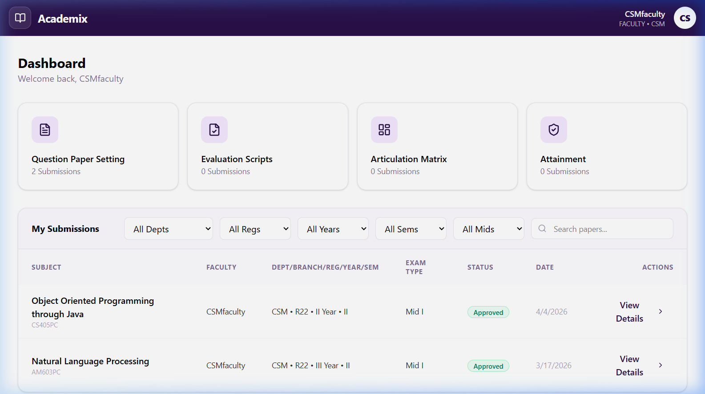
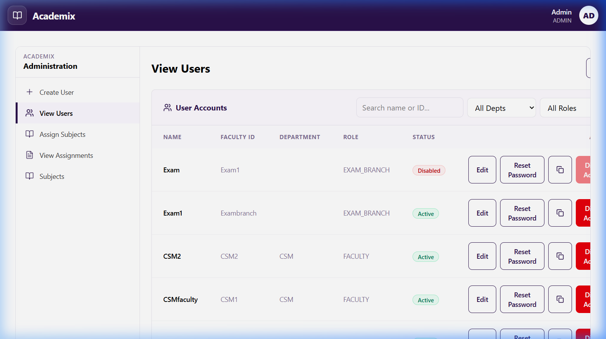
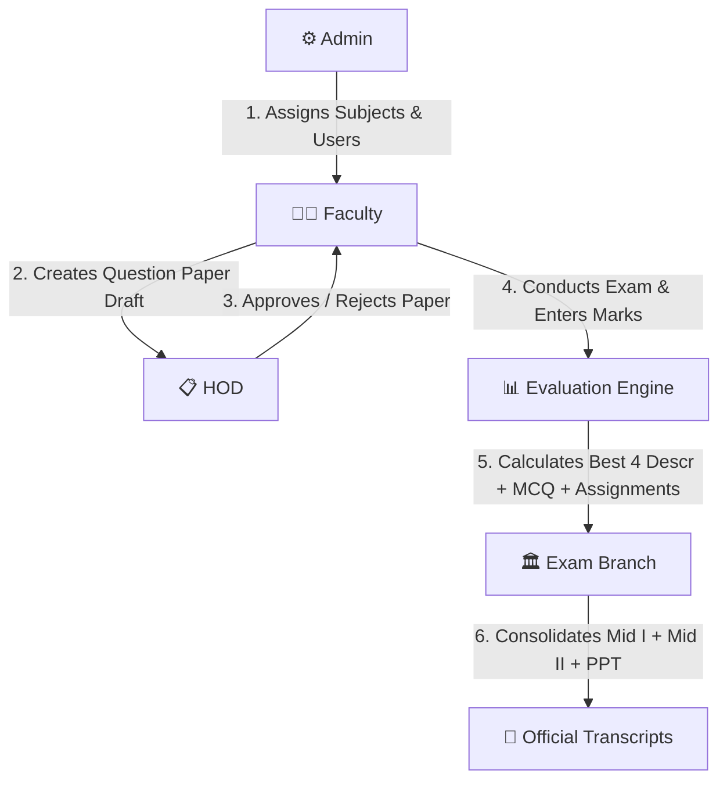

# 🎓 Academix — AI-Powered Academic Evaluation & Question Paper Generator

Academix is a modern, enterprise-grade **Academic Management System & Automated Evaluation Engine** designed for higher education institutions. It streamlines curriculum subject catalogs, automated mid-term question paper generation (with Bloom's Taxonomy & Course Outcome mapping), mid-exam mark entry, evaluation review workflows, and final grade consolidation.


*Faculty Dashboard showing assigned course evaluation workflows and question paper status.*

---

## 🌟 What It Does

Academix automates the end-to-end examination and academic evaluation pipeline for university departments:

- **📄 Automated Question Paper Generation**: Instantly craft mid-term exam question papers with Set A/B/C/D layouts, aligned with **Bloom's Taxonomy Levels (BTL 1–6)** and **Course Outcomes (CO 1–5)**.
- **📝 Mid-Term Mark Evaluation System**: Dedicated portal for faculty to upload section rosters, enter descriptive marks (best 4 of 5 calculation), objective MCQs (0.5 pts each), fill-in-the-blanks, and assignment scores.
- **📊 Final Marks Consolidation**: Automatically aggregates Mid I + Mid II + PPT (Presentation) marks into final official transcripts.
- **🔒 Role-Based Access Control (RBAC)**: Distinct, secure interfaces tailored for **Admin**, **Faculty**, **HOD (Head of Department)**, and **Exam Branch**.
- **📚 Regulation & Subject Catalog Engine**: Built-in support for **JNTUH R22 & R25 Academic Regulations** across 5 academic departments (**H&S, CSE, CSD, CSM, ECE**).
- **🤖 AI-Assisted Assessment**: Integrated Google Gemini AI API support (`@google/genai`) for automated question recommendation and smart rubric validation.
- **📄 Swagger OpenAPI Documentation**: Built-in interactive API tester and documentation at `/swagger`.

---

## 📸 Screenshots

| Faculty Dashboard | Admin Management Panel |
| :---: | :---: |
|  |  |
| *Faculty course roster and evaluation tracker* | *Admin user management, faculty assignments & catalogs* |

---

## 🛠️ Tech Stack

### **Frontend**
- **Framework**: React 19 + TypeScript 5.8
- **Build Tool**: Vite 6
- **Styling**: Tailwind CSS 4 + Custom Design Tokens
- **Animations & Icons**: Motion (Framer Motion) + Lucide React Icons
- **Data Export**: SheetJS (XLSX) for Excel reporting

### **Backend**
- **Runtime**: Node.js 22 + Express 4
- **Language**: TypeScript via `tsx`
- **API Spec**: Swagger UI Express (`/swagger`)
- **Authentication**: Custom Scrypt Password Hashing (`crypto.scryptSync`) + Signed JWT Bearer Tokens

### **Database & Cloud Services**
- **Cloud Database**: PostgreSQL hosted on **Supabase** via `@supabase/supabase-js`
- **Local Fallback Database**: SQLite via `better-sqlite3` (`database/academix.db`)
- **AI Integration**: Google Gemini API via `@google/genai` (`v1.29.0`)

---

## 👥 User Roles & Workflow



---

## 🚀 How to Run Locally

### **Prerequisites**
- **Node.js**: v18.0.0 or higher (v20+ recommended)
- **npm**: v9.0.0 or higher

### **1. Clone & Install Dependencies**
```bash
git clone https://github.com/juhitharamya/Academix.git
cd Academix
npm install
```

### **2. Configure Environment Variables**
Ensure `.env` exists in the repository root (see `.env.example`):
```env
# Ports
PORT=3001
API_PORT=3002


# Auth Token Secret
AUTH_SECRET="change-me"


```

### **3. Start Development Servers**
Run both Frontend and Backend concurrently from the root directory:
```bash
npm run dev
```

Or run each service individually:
- **Backend**: `npm run dev:server` (or `npm --prefix backend run dev`)
- **Frontend**: `npm run dev:client` (or `npm --prefix frontend run dev`)

### **4. Access Points**
- **Faculty / HOD / Exam Branch Portal**: [http://localhost:3001/](http://localhost:3001/)
- **Admin Authentication & Management Panel**: [http://localhost:3001/admin](http://localhost:3001/admin)
- **Backend API & Swagger Documentation**: [http://localhost:3002/swagger](http://localhost:3002/swagger)

---

## 🗝️ Previous Login Details (Supabase Database)

All registered accounts stored in the Supabase `users` database table:

| Role | Username / Faculty ID | Password | Department | Login Portal | Status |
| :--- | :--- | :--- | :--- | :--- | :--- |
| **Admin** | `admin0310@gmail.com` | `12345678` | Administration | `/admin` | Active |
| **Faculty** | `CSM1` | `1234` | CSM | `/` | Active |
| **Faculty** | `CSM2` | `1234` | CSM | `/` | Active |
| **Faculty** | `varshini01` | `1234` | CSM | `/` | Active |
| **HOD** | `HODcsm` | `1234` | CSM | `/` | Active |
| **Faculty** | `H&S1` | `1234` | H&S | `/` | Active |
| **Faculty** | `H&S2` | `1234` | H&S | `/` | Active |
| **HOD** | `HODhs` | `1234` | H&S | `/` | Active |
| **Exam Branch** | `Exambranch` | `1234` | Exam Branch | `/` | Active |
| **Exam Branch** | `Exam1` | `1234` | Exam Branch | `/` | Disabled |

> **Note on Passwords**:
> - **Admin Password**: `12345678` (Sign in at `/admin`)
> - **All Faculty, HOD, and ExamBranch Passwords**: `1234` (Sign in at `/`)

---

## 🔧 Troubleshooting & Common Issues

1. **Admin vs Faculty Login Routes**:
   - The root portal (`/`) is reserved for Faculty, HOD, and Exam Branch accounts. Attempting to log in as Admin on `/` will prompt you to navigate to `/admin`.
   - The `/admin` portal accepts the Admin email (`admin0310@gmail.com`) and password (`12345678`).

2. **Supabase Connectivity**:
   - If Supabase is paused or encounters a DNS error (`getaddrinfo ENOTFOUND`), check project status in the Supabase dashboard to restore connectivity.
   - You can verify backend database health at `http://localhost:3002/api/health`.

3. **Port Conflicts**:
   - If port `3001` or `3002` is in use, you can set custom ports using `PORT=3003 API_PORT=3004 npm run dev`.

---

## 📜 License

This project is released under the **MIT License**.
