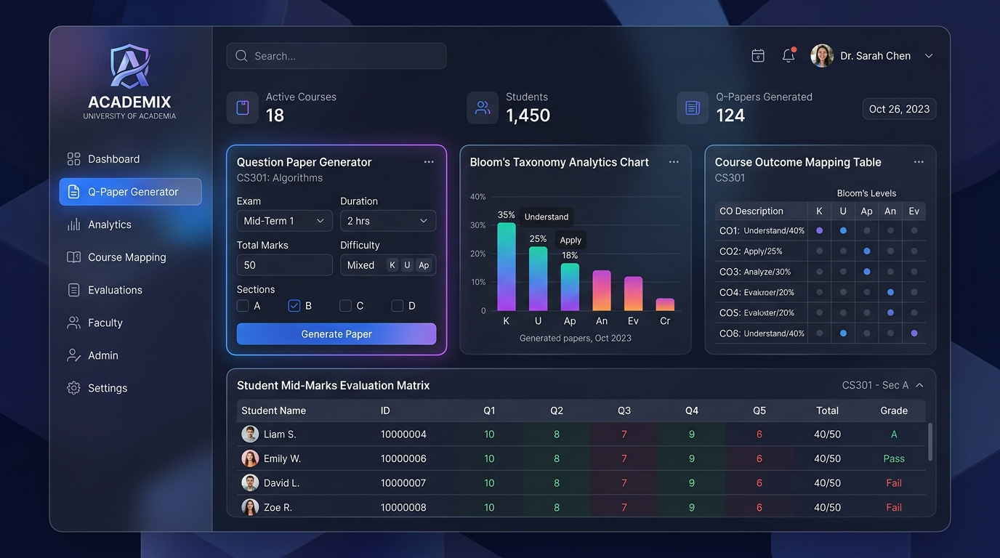
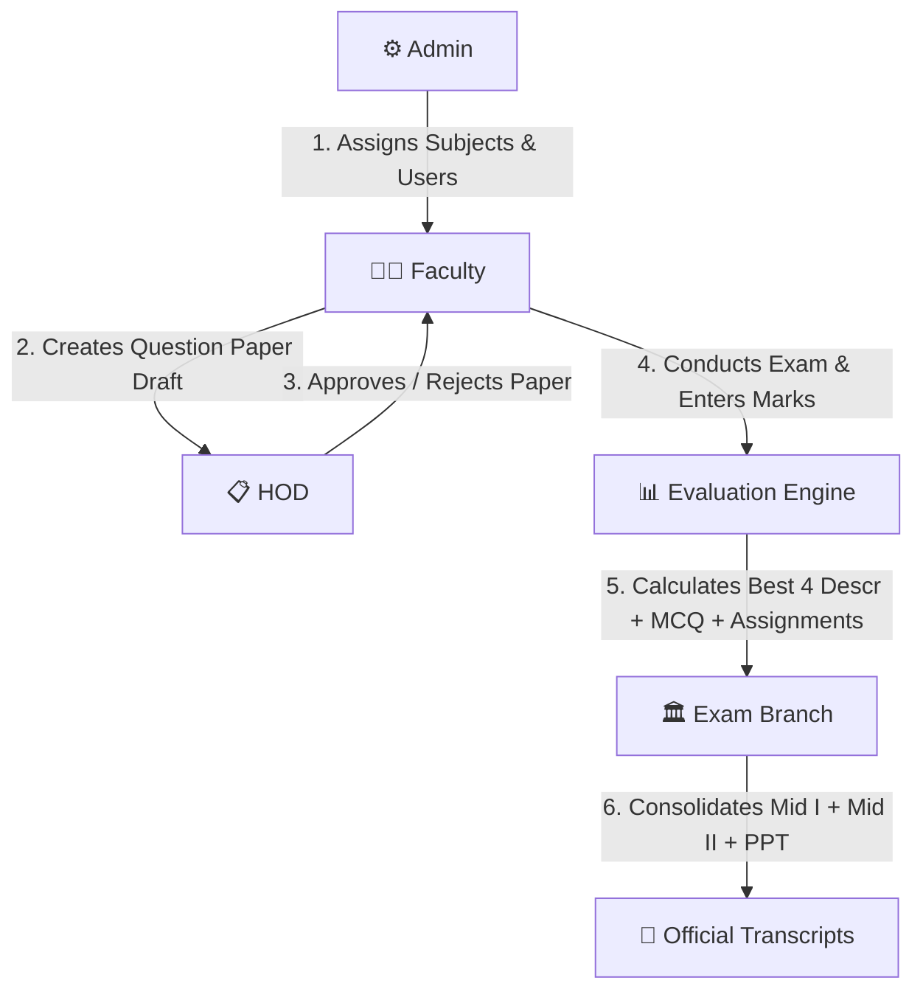

# 🎓 Academix — AI-Powered Academic Evaluation & Question Paper Generator

Academix is a modern, enterprise-grade **Academic Management System & Automated Evaluation Engine** designed for higher education institutions. It streamlines curriculum subject catalogs, automated mid-term question paper generation (with Bloom's Taxonomy & Course Outcome mapping), mid-exam mark entry, evaluation review workflows, and final grade consolidation.



---

## 🌟 What It Does

Academix automates the end-to-end examination and academic evaluation pipeline for university departments:

- **📄 Automated Question Paper Generation**: Instantly craft mid-term exam question papers with Set A/B/C/D layouts, aligned with **Bloom's Taxonomy Levels (BTL 1–6)** and **Course Outcomes (CO 1–5)**.
- **📝 Mid-Term Mark Evaluation System**: Dedicated portal for faculty to upload section rosters, enter descriptive marks (best 4 of 5 calculation), objective MCQs (0.5 pts each), fill-in-the-blanks, and assignment scores.
- **📊 Final Marks Consolidation**: Automatically aggregates Mid I + Mid II + PPT (Presentation) marks into final official transcripts.
- **🔒 Role-Based Access Control (RBAC)**: Distinct, secure interfaces tailored for **Admin**, **Faculty**, **HOD (Head of Department)**, and **Exam Branch**.
- **📚 Regulation & Subject Catalog Engine**: Built-in support for **JNTUH R22 & R25 Academic Regulations** across 5 academic departments (**H&S, CSE, CSD, CSM, ECE**).
- **🤖 AI-Assisted Assessment**: Integrated Google Gemini AI API support (`@google/genai`) for automated question recommendation and smart rubric validation.
- **📄 Swagger OpenAPI Documentation**: Built-in interactive API tester and documentation at `/swagger`.

---

## 🛠️ Tech Stack

### **Frontend**
- **Framework**: React 19 + TypeScript 5.8
- **Build Tool**: Vite 6
- **Styling**: Tailwind CSS 4 + Glassmorphism Design Token System
- **Animations & Icons**: Motion (Framer Motion) + Lucide React Icons
- **Data Export**: SheetJS (XLSX) for Excel reporting

### **Backend**
- **Runtime**: Node.js 22 + Express 4
- **API Spec**: Swagger UI Express (`/swagger`)
- **Authentication**: Custom Scrypt Password Hashing + JWT Bearer Tokens

### **Database & AI**
- **Local DB**: SQLite via `better-sqlite3` (`database/academix.db`)
- **Cloud DB (Optional)**: PostgreSQL via `@supabase/supabase-js`
- **AI Integration**: Google Gemini API via `@google/genai` (`v1.29.0`)

---

## 📊 System Figures & Dataset Overview

- **Dataset Size**: **306 active database records** across 10 SQLite tables.
- **Curriculum Catalog**: **72 seeded subjects** across 4 branches under Regulation R25.
- **Student Roster Dataset**: **128 student entries** with 64 section mark evaluations.
- **Registered User Accounts**: **11 active test accounts** (Faculty, HOD, Exam Branch).
- **Application Interface**: **27 distinct views and admin sub-tabs**.

---

## 👥 User Roles & Workflow



---

## 🚀 How to Run Locally

### **Prerequisites**
- **Node.js**: v18.0.0 or higher
- **npm**: v9.0.0 or higher

### **1. Clone & Install Dependencies**
```bash
git clone https://github.com/juhitharamya/Academix.git
cd Academix
npm install
```

### **2. Configure Environment Variables**
Create a `.env` file in the project root (or copy `.env.example`):
```env
PORT=3001
API_PORT=3002
GEMINI_API_KEY="your_gemini_api_key_here"
```

### **3. Start Development Servers**
Run both the Frontend and Backend concurrently from the root directory:
```bash
npm run dev
```

- **Frontend App**: `http://localhost:3001`
- **Backend API & Swagger Docs**: `http://localhost:3002/swagger`

---

## 🗝️ Default Test Credentials

You can test the application using the pre-seeded user accounts:

| Role | Faculty ID | Password | Access Level |
| :--- | :--- | :--- | :--- |
| **Faculty** | `F001` | *(Default or assigned)* | Create papers, enter evaluation marks |
| **HOD** | `H001` | *(Default or assigned)* | Review & approve department question papers |
| **Exam Branch** | `Exam1` | *(Default or assigned)* | Consolidate final Mid 1, Mid 2 & PPT marks |

---

## 📜 License

This project is released under the **MIT License**.
